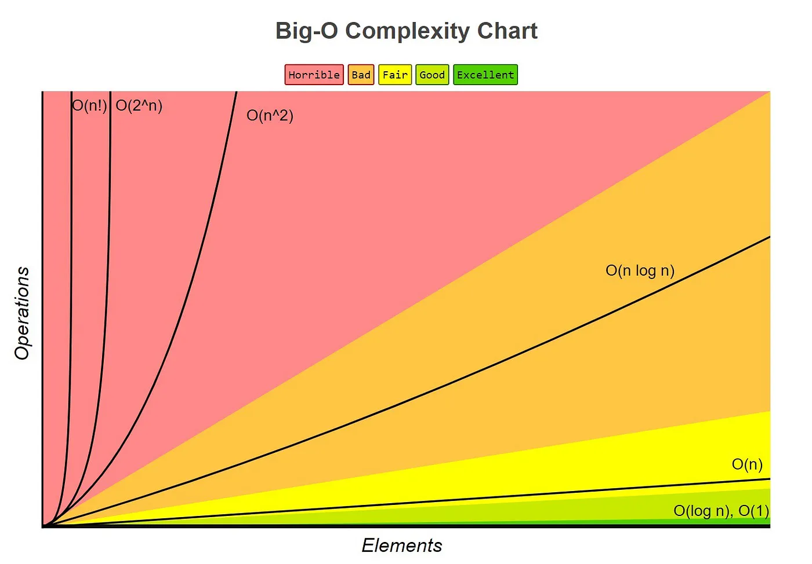

### The bigO
Time and Space. 

<br/>
<br/>
<br/>
<br/>
<br/>
<br/>
<br/>
<br/>
<br/>
<br/>
<br/>
<br/>
<br/>
<br/>
<br/>

## What is Big O
Big O notation classifies an algorithm's time or space efficiency relative to its input size, providing a broad characterization rather than precise metrics. 

It doesn't specify the number of CPU cycles required but rather aims to provide a broad understanding of how the algorithm will perform as the input size grows.


<br/>
<br/>

### Example
So when someone says Oh of N, they mean your algorithm will grow linearily
based on input.

<br/>
<br/>
<br/>
<br/>
<br/>
<br/>
<br/>
<br/>
<br/>
<br/>
<br/>
<br/>
<br/>
<br/>
<br/>

## Why do we use it?
Frequently, understanding the performance implications of various data structures and algorithms through their Big O notation aids in selecting the most suitable options. This knowledge can significantly contribute to developing the most efficient program possible.

Remember this is not a precise measurement, but a broad understanding of how the algorithm will perform as the input size grows.

<br/>
<br/>
<br/>
<br/>
<br/>
<br/>
<br/>
<br/>
<br/>
<br/>
<br/>
<br/>
<br/>
<br/>
<br/>

### So lets do a small example

First, Lets consider the following code.

```typescript
function sum_char_codes(n: string): number {
    let sum = 0;
    for (let i = 0; i < n.length; ++i) {
        sum += n.charCodeAt(i);
    }

    return sum;
}
```

### For those that know big o, this is easy
But those who have never even classified a function, this may be a complete
mystery.  That is fine.

<br/>
<br/>
<br/>
<br/>
<br/>
<br/>
<br/>
<br/>
<br/>
<br/>
<br/>
<br/>
<br/>
<br/>
<br/>

### Big O, said differently
As your input grows, how fast does computation or memory grow?

<br/>
<br/>

### Important concepts
1) growth is with respect to the input

<br/>
<br/>

### In the real world
obviously memory growing is not computationally free, but in the matter of
thinking about algorithms, we don't necessarily think about that.

<br/>
<br/>

In languages like Go or JavaScript you pay even heavier penalties because the
memory can be kept around, grows faster, and causes complete halts in your
program for cleanup.

<br/>
<br/>
<br/>
<br/>
<br/>
<br/>
<br/>
<br/>
<br/>
<br/>
<br/>
<br/>
<br/>
<br/>
<br/>

### Lets go back to our example
Lets look at input.  How does our program's execution time grow with respect to
input?

```typescript
function sum_char_codes(n: string): number {
    let sum = 0;
    for (let i = 0; i < n.length; ++i) {
        sum += n.charCodeAt(i);
    }

    return sum;
}
```

<br>
<br>

Me> It may or may not be obvious, but we have an `N` relationship.  `O(N)` time complexity

<br>

You> How can you tell?

<br/>
<br/>
<br/>
<br/>
<br/>
<br/>
<br/>
<br/>
<br/>
<br/>
<br/>
<br/>
<br/>
<br/>
<br/>

### Simplest trick for complexity
Look for loops

```typescript
function sum_char_codes(n: string): number {
    let sum = 0;
    for (let i = 0; i < n.length; ++i) {
        sum += n.charCodeAt(i);
    }

    return sum;
}
```

<br/>
<br/>
<br/>
<br/>
<br/>
<br/>
<br/>
<br/>
<br/>
<br/>
<br/>
<br/>
<br/>
<br/>
<br/>

### What's the running time
If the previous was O(N), what's this?

```typescript
function sum_char_codes(n: string): number {
    let sum = 0;
    for (let i = 0; i < n.length; ++i) {
        sum += n.charCodeAt(i);
    }

    for (let i = 0; i < n.length; ++i) {
        sum += n.charCodeAt(i);
    }

    return sum;
}
```

<br/>
<br/>
<br/>
<br/>
<br/>
<br/>
<br/>
<br/>
<br/>
<br/>
<br/>
<br/>
<br/>
<br/>
<br/>


<br/>
<br/>
<br/>
<br/>
<br/>
<br/>
<br/>
<br/>
<br/>
<br/>
<br/>
<br/>
<br/>
<br/>
<br/>

### Important concepts
1) growth is with respect to the input
2) Constants are dropped

`O(2N)` -> `O(N)` and this makes sense.  That is because Big O is meant to
describe the upper bound of the algorithm (the growth of the algorithm).  The
constant eventually becomes irrelevant.

<br/>
<br/>

Take the following:

N = 1, O(10N) = 10, O(N^2) = 1

<br/>

N = 5, O(10N) = 50, O(N^2) = 25

<br/>

N = 100, O(10N) = 1,000, O(N^2) = 10,000 // 10x bigger

<br/>

N = 1000, O(10N) = 10,000, O(N^2) = 1,000,000 // 100x bigger

<br/>

N = 10000, O(10N) = 100,000, O(N^2) = 100,000,000 // 1000x bigger

<br/>
<br/>
<br/>
<br/>
<br/>
<br/>
<br/>
<br/>
<br/>
<br/>
<br/>
<br/>
<br/>
<br/>
<br/>

### There is practical vs theoretical differences
Just because N is faster than N^2, doesn't mean practically its always faster
for smaller input.

<br/>
<br/>

Remember, we drop constants.  Therefore O(100N) is faster than O(N^2) but
practically speaking, you would probably win for some small set of input.

<br/>
<br/>
<br/>
<br/>
<br/>
<br/>
<br/>
<br/>
<br/>
<br/>
<br/>
<br/>
<br/>
<br/>
<br/>

### Lets do another example
```typescript
function sum_char_codes(n: string): number {
    let sum = 0;
    for (let i = 0; i < n.length; ++i) {
        const charCode = n.charCodeAt(i);
        // Capital E
        if (charCode === 69) {
            return sum;
        }

        sum += charCode;
    }

    return sum;
}
```

<br/>
<br/>
<br/>
<br/>
<br/>
<br/>
<br/>
<br/>
<br/>
<br/>
<br/>
<br/>
<br/>
<br/>
<br/>

### In BigO we often consider the worst case
Especially in interviews (i have never been asked for best, average, and worst
case, just worst case). <br/>

E = 69 <br/>

Therefore any string with E in it will terminate early (unless E is the last item in the list). <br/>

ITS STILL `O(N)` <br/>

<br/>
<br/>
<br/>
<br/>
<br/>
<br/>
<br/>
<br/>
<br/>
<br/>
<br/>
<br/>
<br/>
<br/>
<br/>

### Important concepts
1) growth is with respect to the input
2) Constants are dropped
3) Worst case is _usually_ the way we measure,

<br/>
<br/>
<br/>
<br/>
<br/>
<br/>
<br/>
<br/>
<br/>
<br/>
<br/>
<br/>
<br/>
<br/>
<br/>

### The common complexities
[Source](https://www.hackerearth.com/practice/notes/big-o-cheatsheet-series-data-structures-and-algorithms-with-thier-complexities-1/)


<br/>
<br/>
<br/>
<br/>
<br/>
<br/>
<br/>
<br/>
<br/>
<br/>
<br/>
<br/>
<br/>
<br/>
<br/>

### Some examples

## O(N^2)
```typescript
function sum_char_codes(n: string): number {
    let sum = 0;
    for (let i = 0; i < n.length; ++i) {
        for (let j = 0; j < n.length; ++j) {
            sum += charCode;
        }
    }

    return sum;
}
```

## O(N^3)
```typescript
function sum_char_codes(n: string): number {
    let sum = 0;
    for (let i = 0; i < n.length; ++i) {
        for (let j = 0; j < n.length; ++j) {
            for (let k = 0; k < n.length; ++k) {
                sum += charCode;
            }
        }
    }
    return sum;
}
```

## O(n log n)
* Quicksort (we will implement and explain) Probably not

## O(log n)
* Binary search trees


<br/>
<br/>
<br/>
<br/>
<br/>
<br/>
<br/>
<br/>
<br/>
<br/>
<br/>
<br/>
<br/>
<br/>
<br/>

## Why so obviated?
There are other resources out there to dive deep into big o notation.  And I
just don't think we need Yet Another Big O explanation.  Instead I am going to
focus on actively looking at running times and we will determine things
together.

<br/>
<br/>

### Important things to remember
1) growth is with respect to the input
2) Constants are dropped
3) Worst case is what we care about for now

<br/>
<br/>


<br/>
<br/>
<br/>
<br/>
<br/>
<br/>
<br/>
<br/>
<br/>
<br/>
<br/>
<br/>
<br/>
<br/>
<br/>


## The Mindset

It's actually the mindset that you're gaining that's actually the useful part. "If I nest a for loop in another for loop, that could be bad." If you gain nothing else from these two sections, gain that!

Really though, it's the additional function in my brain that as I'm writing code is thinking about "can this be done better".

Let's talk about "better" for a second. The temptation after learning about these concepts is to try to optimize every piece of code that you come across. "How can this have the loweset Big O?" is the wrong question to ask. Let's go over some guiding principles.

- There are no rules. "Always do blank". Everything has context. These are just tools and loose decision-making frameworks for you to use to make a contextually good choice.

- There are frequently multiple good choices and almost never a perfect, "right" choice.
  
- Remember how I said that Big O allows you to ignore the coefficients (the 3 in the 3x²)? 
- Sometimes those actually end up being super important. Big O, again, is just a broad stroke. Sometimes the details are super important.
  
- Just as frequently, even the broad strokes are super unimportant. If you have a function that is called just once a day as a background job, it doesn't matter if it finishes in 300 milliseconds or 30 seconds (probably, again, context is important.) Don't spin your wheels on unimportant things.

- In my experience, readability and maintainability are the most important things about code. Code is communication. Clever, performant code is fun to write but hard to maintain later when you have to go figure out what the hell you actually wrote. We write code so that later humans can understand it and secondarily so computers can execute it. If it was just for computers we'd all still be writing assembly. Write your code like you were writing a letter to a future human (probably yourself) on how this works.
  

- Taking the above into account, err on the side of simple code. Simple code is easier to maintain because you can understand it easier and typically ends up having less bugs.
- Human time is almost always more valuable than computer time.

- Normally it's a good idea to not prematurely optimize code. As a general principle, I try to have a perf problem before I try to solve it. Premature optimization will cause you a lot of problems. Frequently you're not solving the right problem and you're left when harder-to-deal-with code.

- 99% of the time you want to use the built-in features to a language or an existing module to do these sorts of heavy lifting. Rarely are you going to write your own sort, you'll just call .sort(). Usually your implementation won't be faster because the built-ins can do tricks you can't (like run it in C/Rust) and they tend to have far less bugs because so many people use them.


### Before we go
Questions?

<br/>
<br/>
<br/>
<br/>
<br/>
<br/>
<br/>
<br/>
<br/>
<br/>
<br/>
<br/>
<br/>
<br/>
<br/>