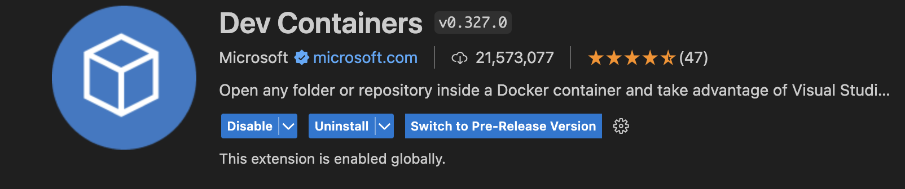

Data Structures and algorithms are the building blocks of computer science.

## Prereq Knowledge

- Basic understanding of Javascript/Typecript

  - loops, if statements, classes

## Getting Started

1. Clone this repo `https://github.com/JMiocevich/introduction-to-datastructures-workshop`

2. Node 20 required, alternative use dev container (docker required)

3. Install dev container extension

4. Goto this icon in bottom left of VsCode and click `Reopen in Container`

5. Type `npm run test` in vscode terminal
